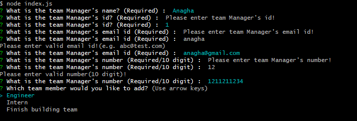

# Team profile generator

## Purpose of application
This application generate a webpage that displays my team's basic info SO THAT I can have quick access to their emails and GitHub profiles. 

## Description
This application is command line application built using inquirer package. This application accepts user input like team manager name,id,email id, office no, Engineer's name,id,email,github username and Intern's name, id, email id, school name. Based on user input an HTML file is generated that displays a nicely formatted team roster.On click of email address in the HTML,
default email program opens and populates the TO field of the email with the address. On click of the GitHub username, GitHub profile opens in a new tab.

## Pre-requisites for project
 * Be sure to include node_modules/ and .DS_Store/ to .gitignore file, so that your node_modules directory isn't tracked or uploaded to GitHub.
 * Make sure project directory includes a package.json with the required dependencies. You can create one by running npm init when you first set up the project, before installing any dependencies.
 * Use command npm i inquirer to install inquirer package.
 * Use npm install --save-dev jest command to install unit test framework Jest.
 * once installation is done, application can be invoked using command : node index.js
 * HTML file will be generated in dist folder.
 * Unit tests can be run using command npm run test.

## Validations 
* Mandatory fields - Name, id, email id, office no
* Office no can be accepted in the formats - (123) 456-7890, (123)456-7890, 123-456-7890, 
1234567890
* Email id should have @ symbol (e.g. abc@test.com)

 ## User Story
AS A manager
I WANT to generate a webpage that displays my team's basic info
SO THAT I have quick access to their emails and GitHub profiles

 ## Acceptance Criteria

GIVEN a command-line application that accepts user input
WHEN I am prompted for my team members and their information
THEN an HTML file is generated that displays a nicely formatted team roster based on user input
WHEN I click on an email address in the HTML
THEN my default email program opens and populates the TO field of the email with the address
WHEN I click on the GitHub username
THEN that GitHub profile opens in a new tab
WHEN I start the application
THEN I am prompted to enter the team manager’s name, employee ID, email address, and office number
WHEN I enter the team manager’s name, employee ID, email address, and office number
THEN I am presented with a menu with the option to add an engineer or an intern or to finish building my team
WHEN I select the engineer option
THEN I am prompted to enter the engineer’s name, ID, email, and GitHub username, and I am taken back to the menu
WHEN I select the intern option
THEN I am prompted to enter the intern’s name, ID, email, and school, and I am taken back to the menu
WHEN I decide to finish building my team
THEN I exit the application, and the HTML is generated

## Video link

[Application walkthrough video link](./images/team-profile.mp4)

## Mock Image
#### HTML File

     

#### Command Line application

     

#### Unit test execution

     

#### Validations

     

## Built With
* Javascript
* Node js
* Inquirer package
* Jest test framework
